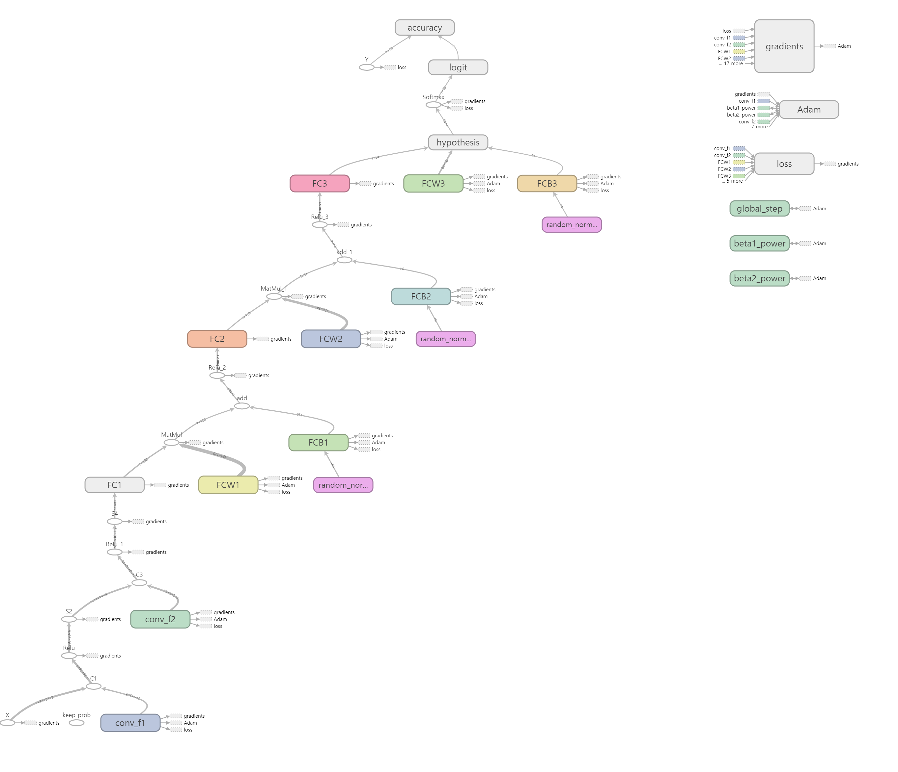
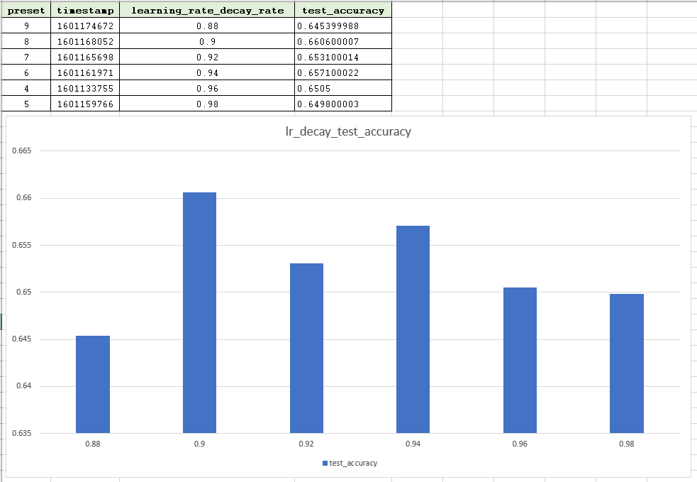

# Lenet5 with CIFAR10 - Tensorflow
*2015410115 송재민*

## Files

- `lenet.py`: Lenet5 모델 구조가 선언되는 파일
- `lenet_eval.py`: Evaluation이 이루어지는 파일
- `lenet_train.py`: Train과 Validation이 이루어지는 파일
- `data_helpers.py`: Data Augmentation 등을 다루는 파일
- `preset.py`: 모델에 사용할 하이퍼파라미터들의 프리셋을 저장
- `tensorboard_run`: Tensorboard를 쉽게 실행하기 위해 작성한 파일
- `./runs`: 학습된 모델들이 저장되는 경로
- `./INFOS/log_eval.txt`: Evaluation 결과가 저장됨
- `./INFOS/train_result.txt`: Train 후 프리셋별 결과 요약되어 저장됨
- `./for_report/Evaluation Report.xlsx`: Train 결과를 기록한 엑셀 파일 (Google Spreadsheet Link)

## Notice
- Learning Rate Decay의 경우 Exponential Decay 방식을 사용. 

## Model Graph

## Hyperparameter Tuning Report

### Learning Rate Decay Rate

우선 Setting 4까지 모두 훈련 시킨 후, 모든 튜닝 요소가 포함된 상태에서 가장 높은 성능을 보이는 Setting 4를 기준으로 하여 모델을 만들어 나가기로 했다. 

처음으로 Learning Rate Decay Rate를 조정해 주었다. Setting 4에서 0.96이라는 값으로 시작하였는데, Learning Rate Decay 없이 학습이 진행된 Setting 3보다 근소하게 낮은 성능을 보였기 때문에 우선 Learning Rate Decay Rate 값을 조정하여 Setting 4에서 Setting 3보다 높은 성능을 내는 것을 목표로 하였다. 

*하늘색이 9번 (1601174672) 파란색이 8번(1601168052)*

결과는 위와 같다. Learning Rate Decay 값이 0.9 일때 가장 좋은 성능을 보였다. 프리셋 9번을 바탕으로 튜닝을 계속해 나갔다.

### Weight Initialization

### 

*색이 비슷해서 헷갈리는데, 파란 색 중 꾸준히 위에 있는 것이 9번(1601174672), 주황색이 11번(1601181490), 나머지 파란색이 12번(1601183728)이다.*

9번 프리셋을 바탕으로 가중치 초기화 방법을 변경해 본 것이 11번과 12번이다. Xavier Initialization과 Standard Deviation이 0.01인 분포로 초기화 하는 것보다, HE Initilization으로 초기화하는 9번이 정확도가 여전히 더 높았다.

### Epoch 

*붉은 색이 13번(1601186644), 파란 색이 9번(1601174672)*

학습속도를 위해 이제까지는 Epoch를 100으로 설정해두고 진행했으나, 현재까지 가장 좋은 9번이 66%대의 성능밖에 보이지 못했기 때문에 한번 Epoch 수를 늘려보도록 했다. Epoch를 200으로 늘린 것이 13번이다. 13번은 확실히 성능이 향상되었지만, 학습 속도가 너무 오래 걸려서 일단 다시 Epoch를 100으로 낮춘 뒤(9번) 튜닝이 모두 끝난 후 다시 200으로 조정하기로 했다.

### Dropout

9번을 바탕으로 Dropout의 `keep_prob` 확률을 0.95로 조정해본 것이 14번이다. 0.85로도 Train해 보았으나 프리셋을 잘못 설정하여 엑셀에 적지는 않았다. 하지만, 명백히 0.95가 0.85와 0.9보다 좋은 성능을 보였다. 14번을 바탕으로 튜닝을 계속해 나갔다.

### Batch Size

*주황색이 15번(1601199835), 회색이 14번(1601197610)*

15번에서는 배치 사이즈를 256으로 2배 늘려주었다. 128인 14번보다 오히려 성능이 떨어졌다. <u>여기서 배치 사이즈와 에포크를 동시에 2배로 증가시키면 성능이 잘 나올 것 같다는 생각을 했다.</u>

### Weight Decay

16번 에서는 Weigh Decay의 l2_lambda 값을 0.00001로 1/10배 해주었지만, 역시 14번 보다 성능이 떨어졌다.

### Learning Rate (`starter_learning_rate`)

17번과 18번은 각각 `starter_learning_rate`값을 1/10배, 10배 해준 결과이지만 성능이 큰 폭으로 떨어졌다.

### Batch Size & Epoch

Batch Size를 튜닝할 때 생각했던 것으로, 19번은 배치 사이즈를 2배(256), 에포크를 2배(200)로 설정해 주었다. 15번의 정확도 그래프가 epoch의 증가에 따라 우측으로 길게 잡아당겨 지면, 훨씬 높은 정확도가 나올 것 같다는 아이디어에서였다.

*진한 주황색이 19번(1601209339)이고, 회색이 14번(1601197610)이다. 밝은 주황색은 위에서 보았던 15번(1601199835)이다.*

확실히 성능은 올라갔지만, 인상적으로 올라가지는 않았다. 여전이 72%에 비해 턱없이 낮은 수치이다. 배치 사이즈와 에포크의 배수를 더 늘리면, 그래프가 위쪽으로 더 올라갈까? 이번 튜닝으로 1%의 성능 향상이 있었는데, 이것을 더 튜닝한다고 하더라도 72%에 도달하기에는 어려워 보인다.

## 개선할 점

결국 과제 목표 정확도인 72%에 도달하지 못했다. Weight Initialization을 라이브러리에서 가져오지 않고 직접 구현해보고 싶었지만 자꾸 오류가 나서 그냥 텐서플로에서 제공하는 initializer를 쓴 것이 아쉽다. 지난 과제로 텐서플로우에 조금 익숙해 져서 코드를 작성하는 데에 드는 시간이 많이 단축되었지만, 모델을 학습하는 시간이 훨씬 증가해서 시간은 오히려 더 부족했던 것 같다. 다음부터 GPU를 사용하여 학습 시간을 단축할 수 있었으면 좋겠다. 프리셋 별로 모델을 훈련하는데 30 ~ 60분이 걸려서 좀 더 다양한 파라미터 튜닝을 해보지 못한게 정말로 아쉽다.

배치 사이즈와 에포크를 처음부터 튜닝했었어야 했는데라는 후회감이 몰려온다. 이제 좀 그래프를 독해하는 능력이 생긴 것 같은데, 더 튜닝을 하기에는 시간이 너무 부족하다.

왜 72%에 도달하지 못했는지 결정적인 원인을 파악할 수 없다는 것이 가장 큰 문제이다. 솔직히 파라미터 튜닝은 이정도면 할 만큼 한 것 같은데, 그렇다면 모델 자체의 구조를 뭔가 잘 못 짠 것은 아닐까? 

